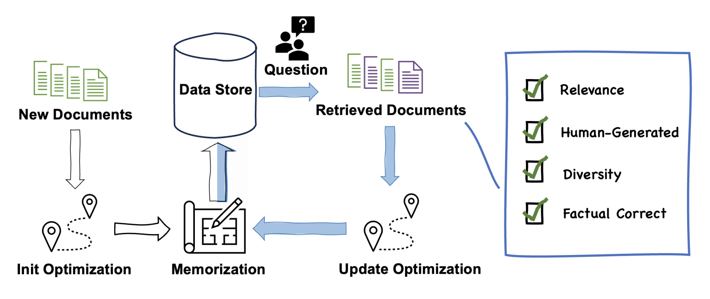

# Codebase of "Breaking the Spiral: A Utility-Driven Optimization Framework for Balanced Information Retrieval in the LLM Era"
<details>
  <summary>Table of Contents</summary>
  <ol>
    <li><a href="#news-and-updates">News and Updates</a></li>
    <li><a href="#introduction">Introduction</a></li>
    <li><a href="#installation">Installation</a></li>
    <li><a href="#usage">Usage</a></li>
    <li><a href="#evaluation">Evaluation</a></li>
    <li><a href="#more-use-examples">More Use Examples</a></li> 
  </ol>
</details>

<!-- News and Updates -->

## News and Updates
- [03/12/2025] 💻 Published code used in our experiments.


<!-- Introduction -->

## Introduction

In this study, we propose a Utility-Driven Multi-Objective Optimization (UMO) framework to effectively mitigate the “Spiral of Silence”. 

This framework employs a two-phase approach: an optimization phase, leveraging the NSGA-II algorithm to optimize multiple objectives simultaneously, and a memorization phase, which directly integrates these weights into the retrieval vector space without requiring additional model retraining. 

For further exploration of the “Spiral of Silence” phenomenon, please refer to [SOS-Retrieval-Loop](https://github.com/VerdureChen/SOS-Retrieval-Loop).





## Installation
<!-- 
我们的方法基于此前的工作，因此您可以根据 [SOS-Retrieval-Loop](https://github.com/VerdureChen/SOS-Retrieval-Loop)中[Installation](https://github.com/VerdureChen/SOS-Retrieval-Loop?tab=readme-ov-file#installation)的说明进行安装。
-->

Since our method is based on previous work, you may proceed with the installation by following the guidelines provided 
in the [Installation](https://github.com/VerdureChen/SOS-Retrieval-Loop?tab=readme-ov-file#installation) section of the [SOS-Retrieval-Loop](https://github.com/VerdureChen/SOS-Retrieval-Loop).
However, if you intend to run UMO independently, the **api-for-open-llm** is **not** a requisite component.

## Usage

Please see [Installation](#installation) to install the required packages.
<!-- 
在运行我们的框架之前，您需要先启动ElasticSearch。在启动ElasticSearch时，您需要在其config/elasticsearch.yml文件中设置好对应的http.port和http.host，它们将用于本仓库代码运行的配置。
在启动api-for-open-llm时，您需要在.env文件中设置好PORT，它也将作为本代码库需要的配置。
-->
Before running our framework, you need to start **ElasticSearch**. When starting **ElasticSearch**, you need to set the appropriate `http.port` and `http.host` in its `config/elasticsearch.yml` file, as these will be used for the configuration needed to run the code in this repository.


<!--
### Running the Code
通过以下步骤，运行实验：
1. 数据集预处理：不论是查询还是文档，我们都需要将数据集转化为jsonl格式。我们的实验中使用data.wikipedia_split.psgs_w100数据，可参考[DPR仓库](https://github.com/facebookresearch/DPR?tab=readme-ov-file#resources--data-formats)的说明将其下载至`data_v2/raw_data/DPR`目录下并解压。我们提供一个简单的脚本`data_v2/gen_dpr_hc_jsonl.py`，可以将数据集转化为jsonl格式并放置于`data_v2/input_data/DPR`。实验中使用到的query文件位于`data_v2/input_data/DPR/modified_sampled_query`。
   ```bash
    cd data_v2
    python gen_dpr_hc_jsonl.py 
    ```
   在我们的方法中，每个文档都含有一个权重。在初始化时，对于psgs_w100数据集，我们设置每个文档的权重为1。可以在`src/fake_alpha.py`中设置对应路径后，为每个文档设置权重。

2. 建立数据集索引：使用`src/retrieval_loop/run_index_builder.sh`，通过修改文件中的`MODEL_NAMES`和`DATA_NAMES`配置，能够一次性建立所有数据和模型的索引。你也可以通过配置`src/retrieval_loop/index_configs`中config文件的`query_files`和`output_files`来获得基于该索引的对应方法的检索结果。在我们的实验中所有检索模型checkpoint放在`ret_model`目录下。
   运行：
   ```bash
    cd src/retrieval_loop
    bash run_index_builder.sh
   ```
3. 在迭代中运行UMO：使用`src/run_weight_loop.sh`，通过修改文件中的`QUERY_DATA_NAMES`配置，能够批量化运行所有数据的UMO方法。你可以通过设置`TOTAL_LOOP_NUM`来控制循环次数，由于涉及到索引多次更新，每次只能运行一个检索方法pipeline。注意，请在`src/run_weight_loop.sh`中每次运行`../rewrite_configs.py`时配置好参数。对于不需要随迭代改变的参数，可以在`src/retrieval_loop`中的各个config目录下的文件中配置。
    运行：
    ```bash
    cd src
    bash run_weight_loop.sh
    ```
-->

### Running the Code
To run our framework, follow these steps:
1. Dataset Preprocessing: Whether it is a query or a document, we need to convert the dataset to jsonl format. In our experiments, we use the data.wikipedia_split.psgs_w100 dataset, which can be downloaded to the `data_v2/raw_data/DPR` directory and unzipped according to the instructions in the [DPR repository](https://github.com/facebookresearch/DPR?tab=readme-ov-file#resources--data-formats). We provide a simple script `data_v2/gen_dpr_hc_jsonl.py`, which can convert the dataset to jsonl format and place it in `data_v2/input_data/DPR`. The query files used in the experiment are located in `data_v2/input_data/DPR/modified_sampled_query`.
   ```bash
    cd data_v2
    python gen_dpr_hc_jsonl.py 
    ```
    In our method, each document has a weight. At initialization, for the psgs_w100 dataset, we set the weight of each document to 1. You can set the weight for each document by setting the corresponding path in `src/fake_alpha.py` and running the script.
2. Build Index: Use `src/retrieval_loop/run_index_builder.sh`, by modifying the `MODEL_NAMES` and `DATA_NAMES` configuration in the file, you can build indexes for all data and models at once. You can also obtain the retrieval results based on this index for the corresponding method by configuring `query_files` and `output_files` in the config files in `src/retrieval_loop/index_configs`. In our experiments, all retrieval model checkpoints are placed in the `ret_model` directory.
   Run:
   ```bash
    cd src/retrieval_loop
    bash run_index_builder.sh
   ```
3. Run UMO in Iterations: Use `src/run_weight_loop.sh`, by modifying the `QUERY_DATA_NAMES` configuration in the file, you can run the UMO method for all data in batches. You can control the number of loops by setting `TOTAL_LOOP_NUM`. Since it involves multiple index updates, only one retrieval method pipeline can be run at a time. Please configure the parameters following `../rewrite_configs.py` in `src/run_weight_loop.sh`. For parameters that do not need to change with iterations, you can configure them in the files in the config directories in `src/retrieval_loop`.
    Then run:
    ```bash
    cd src
    bash run_weight_loop.sh
    ```
<!--
## Evaluation
面向实验中生成的大量数据，为了支持批量化的评估方法，设置`src/evaluation/run_context_eva.sh`脚本中的`QUERY_DATA_NAMES`和`RESULT_NAMES`后，可以进行`TASK`评估：
1. `TASK="retrieval"`：对每次迭代的检索和重排序结果进行评估，包括Acc@5和Acc@20。
2. `TASK="bleu"`：计算每次迭代上下文的SELF-BLEU值。
3. `TASK="llm_text_type_rate"`：计算每次迭代检索结果中各LLM和人类生成文本的百分比。
4. `TASK="correctness_query"`：计算在每次迭代结束时检索结果中包含不同数量正确文档的查询个数。
评估后生成的结果文件默认存于对应`RESULT_DIR/RESULT_NAME/QUERY_DATA_NAME/results`目录下。
-->
## Evaluation
To support batch evaluation methods for the large amount of results in the experiments, after setting `QUERY_DATA_NAMES` and `RESULT_NAMES` in the `src/evaluation/run_context_eva.sh` script, you can perform `TASK` evaluation:
1. `TASK=("retrieval")`: Evaluate the retrieval results of each iteration, including Acc@5 and Acc@20.
2. `TASK=("bleu")`: Calculate the SELF-BLEU value of the context for each iteration.
3. `TASK=("llm_text_type_rate")`: Calculate the percentage of text generated by each LLM and human in the retrieval results for each iteration.
4. `TASK=("correctness_query")`: Calculate the number of queries containing different numbers of correct documents in the retrieval results at the end of each iteration.

The results generated after evaluation are stored by default in the corresponding `RESULT_DIR/RESULT_NAME/QUERY_DATA_NAME/results` directory.


<!--
## More Usage
### Checkpoint
在我们的实验中，为了更好地识别检索结果中来源于LLM的文本。我们基于NQ，WebQA，TriviaQA的训练数据和LLM根据训练集查询生成的段落重新训练了[Hello-SimpleAI/chatgpt-qa-detector-roberta](https://huggingface.co/Hello-SimpleAI/chatgpt-qa-detector-roberta)，请访问[Xiaoyang221029/fine-tuned-chatgpt-qa-detector-roberta](https://huggingface.co/Xiaoyang221029/fine-tuned-chatgpt-qa-detector-roberta)下载和使用该模型。
### 从索引删除相应文档
由于我们的实验涉及到索引的动态更新，我们不可能在每次模拟中重新从零构造索引。相反地，在每次模拟时，我们都会将新增文本ID记录在`src/run_logs`中对应此次实验的`index_add_logs`目录下，待实验结束后，我们通过`src/post_process/delete_doc_from_index.py`脚本删除索引中的相应文档。
当需要删除Faiss索引中的文档时，运行：
```bash
cd src/post_process
python delete_doc_from_index.py --config_file_path delete_configs/delete_config_pickles.json
```
其中，`src/post_process/delete_configs/delete_config_pickles.json`是对应配置文件，将`"pickle_file_path"`，`"id_files"`以及`"delete_log_path"`设置为对应的路径。
-->
## More Usage
### Checkpoint
In our experiments, to better identify the text from LLM in the retrieval results, we retrained [Hello-SimpleAI/chatgpt-qa-detector-roberta](https://huggingface.co/Hello-SimpleAI/chatgpt-qa-detector-roberta) based on the training data of NQ, WebQA, TriviaQA, and the paragraphs generated by LLM according to the training set queries. Please visit [Xiaoyang221029/fine-tuned-chatgpt-qa-detector-roberta](https://huggingface.co/Xiaoyang221029/fine-tuned-chatgpt-qa-detector-roberta) to download and use this model.
### Delete Corresponding Documents from the Index
Since our experiments involve dynamic updates to the index, it is not possible to reconstruct the index from scratch in each simulation. Instead, in each simulation, we record the newly added text IDs in the `index_add_logs` directory corresponding to this experiment in `src/run_logs`. After the experiment ends, we delete the corresponding documents from the index using the `src/post_process/delete_doc_from_index.py` script.
To delete documents from the Faiss index, run:
```bash
cd src/post_process
python delete_doc_from_index.py --config_file_path delete_configs/delete_config_pickles.json
```
where `src/post_process/delete_configs/delete_config_pickles.json` is the corresponding configuration file. Set `"pickle_file_path"`, `"id_files"`, and `"delete_log_path"` to the corresponding paths.

